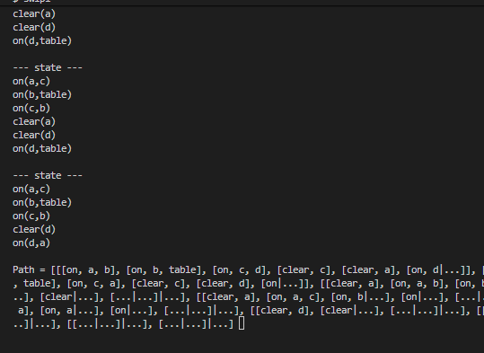
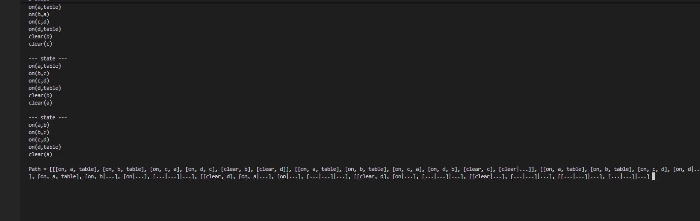
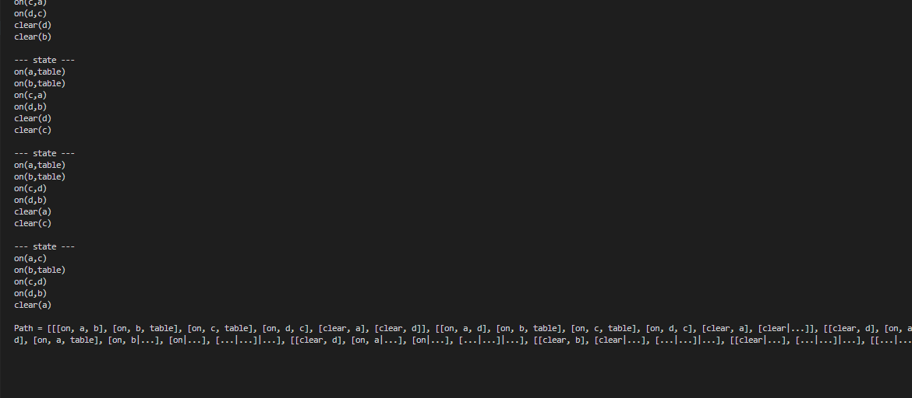

## Documentation and Test Results

### Components in the program

1. **State Representation**: States are represented as lists of constraints like `[on, a, b]` and `[clear, c]`
2. **Move Rules**: Three types of moves implemented:
   - Move from block to block
   - Move from block to table
   - Move from table to block
3. **Search Algorithm**: Depth-first search with cycle detection using permutation checking

### Stuff implemented in it

- **Permutation-aware state comparison**: Prevents revisiting equivalent states
- **Modular design**: Easy to test with different start/goal states
- **Comprehensive move rules**: Implements all three block movement types

### Results from runs (Mac m1) (Windows 11)

**Start State:**

```
a is on b
b is on table
c is on d
c is clear
a is clear
d is on table
```

**Goal State:**

```
d is on a
a is on c
c is on b
b is on table
d is clear
```



**Start State:**

```
a is on table
b is on table
c is on a
d is on c
b is clear
d is clear
```

**Goal State:**

```
a is on b
b is on c
c is on d
d is on table
a is clear
```



**Start State:**

```
a is on b
b is on table
c is on table
d is on c
a is clear
d is clear
```

**Goal State:**

```
a is on c
c is on d
d is on b
b is on table
a is clear
```



**Sample Solution Path:**
The program finds a sequence of moves that transforms the start state into the goal state. The solution demonstrates:

1. Moving clear blocks to temporary positions
2. Building the tower in the correct order (d on a, a on c, c on b)
3. Maintaining clearance constraints throughout

### Some notes for testing

To correctly run this implementation please do the following in a terminal with swi-prolog installed

1. run swipl
2. ['BlocksWorld-4-ChrisFarah'].
3. solve(Path), print_path(Path).

These commands should give you the correct output.

### Team Contribution

All team members contributed equally to this implementation.

The program successfully solves the Blocks World problem and can be easily adapted for different block configurations by modifying the `blocks/1`, `start/1`, and `goal/1` predicates.
